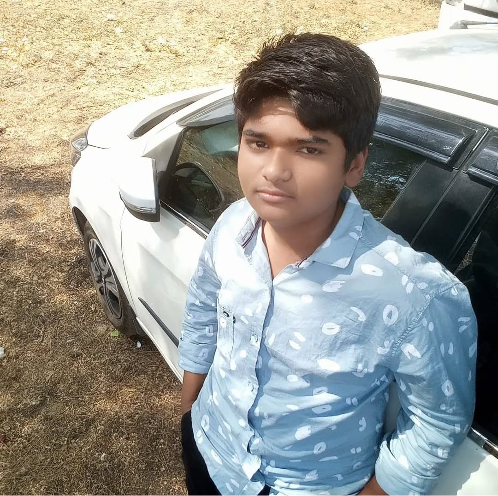
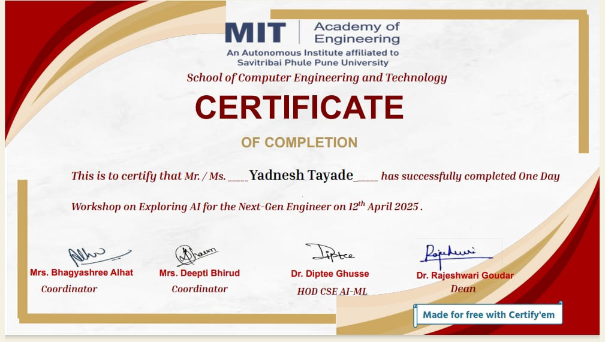

# Portfolio-Project

<!DOCTYPE html>
<html lang="en">
<head>
  <meta charset="UTF-8" />
  <meta name="viewport" content="width=device-width, initial-scale=1.0"/>
  <title>YADNESH - Portfolio</title>
  
</head>
<body>

  <!-- Header -->
  <header>
    <h1>Yadnesh</h1>
    <nav>
      <a href="#">Home</a>
      <a href="#about">About</a>
      <a href="#achievements">Achievements</a>
      <a href="#certificate">Certificate</a>
      <a href="#hobbies">Hobbies</a>
      <a href="#contact">Contact</a>
    </nav>
  </header>

  <!-- Hero Section -->
  <section class="hero">
    

      <h3>Future Programmer</h3>
      <h1>Hi, I'm Yadnesh Nilkanth Tayade From India</h1>
    

    

      
    

  </section>

  <!-- About Section -->
  <section id="about">
    

      
    

    

      <h2>About Me</h2>
      
Hello! My name is Yadnesh Nilkanth Tayade, and I’m from Akola, Maharashtra. I am currently a first-year student at MITAOE, Pune, pursuing my passion for technology in the AI-ML batch.

      

        
Skills

        
Experience

        
Education

      

      

        <h4>C language</h4>
        
I know the basics of the C language and am currently learning more.

        <h4>Python language</h4>
        
I have a solid understanding of python programming, though I’m not yet at an advanced level.

        <h4>Data analysis</h4>
        
I'm working towards becoming a proficient data analyst.

      

      

        
I may not have experience yet, but I am eager to learn and embrace new opportunities.

      

      

        
I passed the 10th grade from the ICSE board with over 85% and the 12th grade from the HSC board with over 85%. Now, I'm pursuing my AIML degree at MITAOE, Pune.

      

    

  </section>

  <!-- Hobbies Section -->
  <section id="hobbies">
    <h2>Hobbies</h2>
    

      

        <h4>Gaming</h4>
        
Gaming is not only fun but also sharpens my problem-solving and strategic thinking abilities.

      

      

        <h4>Programming</h4>
        
Programming is both a hobby and a passion, and I love learning new languages and techniques.

      

      

        <h4>Volleyball</h4>
        
Volleyball helps me stay fit, and I enjoy playing team sports with my friends.

      

    

  </section>

  <!-- Achievements Section -->
  <section id="achievements" style="padding: 80px 60px; background: #000; color: white;">
    <h2 style="font-size: 2.5rem; color: #ff3c68; margin-bottom: 40px; text-align: center;">Achievements</h2>
    

      

        <h4 style="color: #ff3c68; margin-bottom: 10px;">Hackathon Participation</h4>
        
Participated in my first university-level hackathon and collaborated on a team project that focused on solving real-world problems using AI solutions.

      

      

        <h4 style="color: #ff3c68; margin-bottom: 10px;">Python Mini Projects</h4>
        
Created several mini projects using Python, including a calculator, number guessing game, and basic data visualizations using Matplotlib and Pandas.

      

      

        <h4 style="color: #ff3c68; margin-bottom: 10px;">Course Certifications</h4>
        
Earned certifications in Python basics, C programming, and introductory Data Analytics from online platforms like Coursera and Great Learning.

      

    

  </section>

  <!-- Certificate Section -->
  <section id="certificate" style="padding: 80px 60px; background: #000; text-align: center;">
    <h2 style="font-size: 2.5rem; margin-bottom: 40px; color: #ff3c68;">Certificates</h2>
    

      
      
      
    

  </section>

  <!-- Skills Section -->
  <section id="skills">
    <h2>My Skills</h2>
    

      

        
        <h3>C Language</h3>
        
Basic understanding of C programming concepts and syntax.

      

      

        
        <h3>Python</h3>
        
Proficient in Python for data analysis, scripting, and automation.

      

      

        
        <h3>HTML</h3>
        
Understanding of HTML structure for building web pages.

      

      

        
        <h3>CSS</h3>
        
Basic styling and layout techniques for web development using CSS.

      

      

        
        <h3>JavaScript</h3>
        
Basic JavaScript for adding interactivity to web pages.

      

    

  </section>
  
  
  <!-- Alternative Project Section -->
  <section id="projects" style="padding: 80px 60px; background: #0a0a0a; color: white;">
    <h2 style="text-align: center; font-size: 2.5rem; margin-bottom: 50px; color: #ff3c68;">My Projects</h2>
    
Explore some of the projects I have worked on. These projects showcase my programming skills and passion for creating solutions.

    
    

      

        
        <h3 style="font-size: 1.8rem; color: #ff3c68; margin: 15px 0;">Project 1</h3>
        
A simple website created with HTML, CSS, and JavaScript to showcase basic web development skills.

        <a href="#" style="display: inline-block; margin-top: 10px; color: #ff3c68; text-decoration: none; font-weight: bold;">View Project</a>
      

  
      

        
        <h3 style="font-size: 1.8rem; color: #ff3c68; margin: 15px 0;">Project 2</h3>
        
A data analysis project utilizing Python, Pandas, and Matplotlib to visualize real-world data sets.

        <a href="#" style="display: inline-block; margin-top: 10px; color: #ff3c68; text-decoration: none; font-weight: bold;">View Project</a>
      

  
      

        
        <h3 style="font-size: 1.8rem; color: #ff3c68; margin: 15px 0;">Project 3</h3>
        
A small game created using Python and the Pygame library to showcase my interest in game development.

        <a href="#" style="display: inline-block; margin-top: 10px; color: #ff3c68; text-decoration: none; font-weight: bold;">View Project</a>
      

    

  </section>
  
  
  

  <!-- Contact Section -->
  <section id="contact" style="padding: 80px 60px; background: #0a0a0a; display: flex; flex-wrap: wrap; justify-content: space-between; align-items: flex-start; color: white;">
    

      <h2 style="font-size: 2.5rem; margin-bottom: 20px;">Contact Me</h2>
      
📧 yadneshtayade2@gmail.com

      
📞 0123456789

      

        
        
        
        
      

      <a href="#" style="display: inline-block; padding: 12px 24px; background: #ff3c68; border-radius: 6px; color: white; font-weight: 600; margin-top: 10px;">Download CV</a>
    

    

      <form>
        <input type="text" placeholder="Your Name" style="width: 100%; padding: 15px; margin-bottom: 15px; border: none; border-radius: 6px; background: #1e1e1e; color: white;">
        <input type="email" placeholder="Your Email" style="width: 100%; padding: 15px; margin-bottom: 15px; border: none; border-radius: 6px; background: #1e1e1e; color: white;">
        <textarea placeholder="Your Message" rows="5" style="width: 100%; padding: 15px; margin-bottom: 15px; border: none; border-radius: 6px; background: #1e1e1e; color: white;"></textarea>
        <button type="submit" style="padding: 12px 24px; background: #ff3c68; border: none; border-radius: 6px; color: white; font-weight: 600;">Submit</button>
      </form>
    

  </section>

  <!-- JavaScript for Tabs -->
  

</body>
</html>
